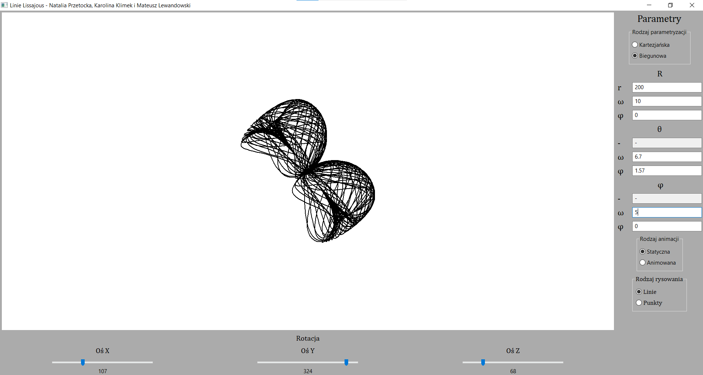

# Visualisation of Lissajous Curves - project 2022

### Interface

1. Panel with the curve
2. Fields for entering parameters of the curve
3. Curve rotation panel
4. Fields for entering animation type (static or animated)
5. Fields for entering drawing type (curves or points)
6. Fields for entering parametrization type

### Sample program results

