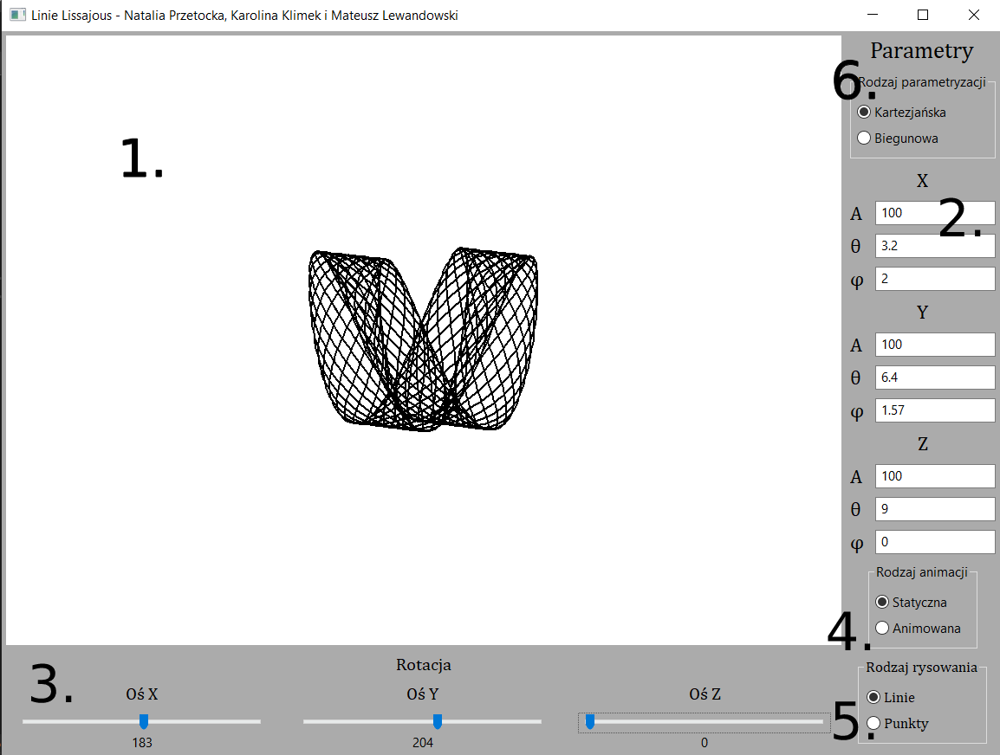

# Wizualizacja Krzywych Lissajous - projekt 2022

### Wygląd aplikacji

1. Panel na rysowaną krzywą
2. Pola do wpisywania parametrów
3. Panel z suwakami do obrotu narysowanej krzywej
4. Pola do wyboru rodzaju animacji
5. Pola do wyboru rodzaju rysowania
6. Pola do wyboru rodzaju parametryzacji
